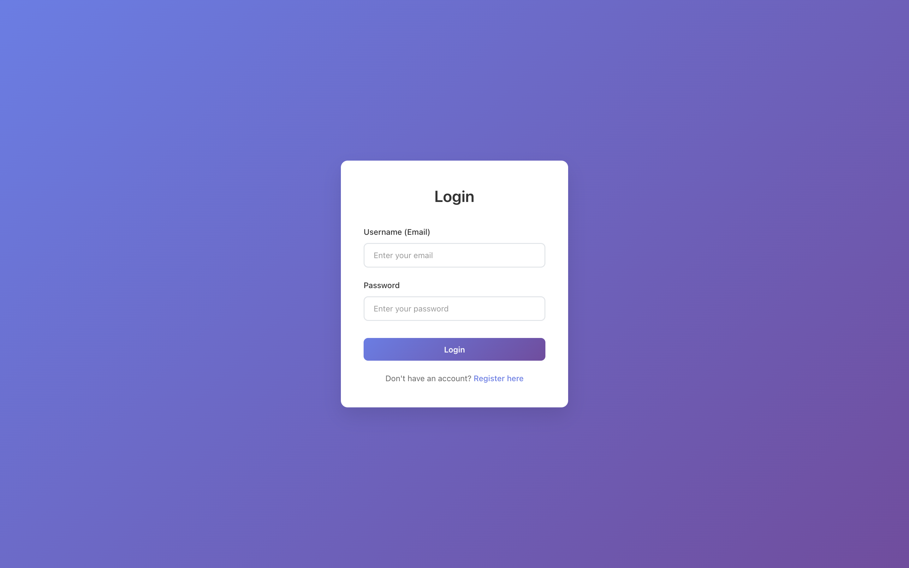
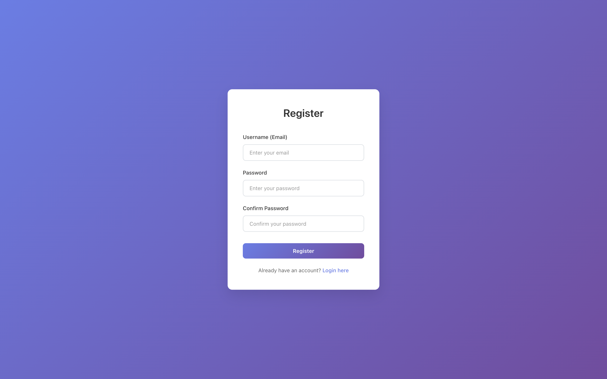
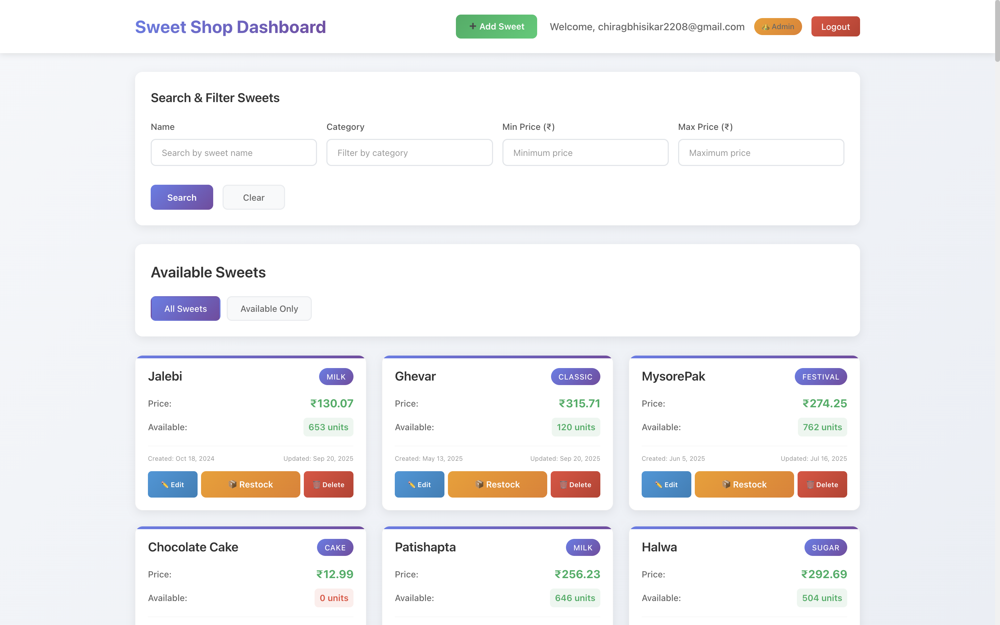

# Incubyte Project Backend - Complete Documentation

## Table of Contents
1. [Project Overview](#project-overview)
2. [Technology Stack](#technology-stack)
3. [Project Structure](#project-structure)
4. [Database Schema](#database-schema)
5. [API Documentation](#api-documentation)
6. [Security Implementation](#security-implementation)
7. [Service Layer](#service-layer)
8. [Data Transfer Objects (DTOs)](#data-transfer-objects-dtos)
9. [Exception Handling](#exception-handling)
10. [Configuration](#configuration)
11. [Testing](#testing)
12. [Deployment](#deployment)
13. [Development Guidelines](#development-guidelines)

---

## Project Overview

**Incubyte Project Backend** is a Spring Boot-based REST API application for managing a sweet shop inventory system. The application provides comprehensive functionality for user authentication, sweet management, inventory tracking, and sales operations.

### Key Features:
- **User Authentication & Authorization**: JWT-based authentication with role-based access control
- **Sweet Management**: CRUD operations for sweet inventory
- **Inventory Management**: Stock tracking, purchasing, and restocking
- **Search & Catalog**: Advanced search and filtering capabilities
- **Security**: Comprehensive security implementation with Spring Security
- **Validation**: Input validation using Bean Validation (JSR-303)
- **Exception Handling**: Global exception handling with custom exceptions

### Business Domain:
The application manages a sweet shop with the following core entities:
- **Users**: Customers and administrators
- **Sweets**: Products with categories, prices, and inventory
- **Transactions**: Purchase and restock operations


# 🍬 Kata Sweet Shop Management System For Admin

## 🧁 Login


## 🧁 Register


## 🧁 Dashboard


## ➕ Add Sweet


## 🏠 Edit Sweet


## 🗑️ Delete Sweet


## 🔁 Restock Screen


## 📦 Purchase Screen


# 🍬 Kata Sweet Shop Management System For User

## 🧁 Dashboard


## ➕ Purchase Sweet


---

## Technology Stack

### Core Framework
- **Spring Boot 3.5.5**: Main application framework
- **Java 21**: Programming language
- **Maven**: Build and dependency management

### Database & Persistence
- **MySQL 8.0.33**: Primary database
- **Spring Data JPA**: Data access layer
- **Hibernate**: ORM implementation

### Security
- **Spring Security**: Authentication and authorization
- **JWT (JSON Web Tokens)**: Token-based authentication
- **BCrypt**: Password encoding

### Validation & Mapping
- **Bean Validation (JSR-303)**: Input validation
- **ModelMapper 3.2.4**: Object mapping
- **Lombok**: Code generation

### Testing
- **JUnit 5**: Unit testing framework
- **Mockito**: Mocking framework
- **Spring Boot Test**: Integration testing
- **MockMvc**: Web layer testing

### Development Tools
- **Spring Boot DevTools**: Hot reloading
- **Maven Wrapper**: Consistent build environment

---

## Project Structure

```
src/
├── main/
│   ├── java/com/incubyte/incubyte_project_backend/
│   │   ├── configuration/          # Configuration classes
│   │   │   ├── AuthenticationManagerConfig.java
│   │   │   ├── MapperConfig.java
│   │   │   └── SecurityEncoderConfig.java
│   │   ├── controller/             # REST controllers
│   │   │   ├── AuthController.java
│   │   │   └── SweetController.java
│   │   ├── dto/                    # Data Transfer Objects
│   │   │   ├── request/            # Request DTOs
│   │   │   │   ├── auth/
│   │   │   │   │   ├── LoginRequestDto.java
│   │   │   │   │   └── SignUpRequestDto.java
│   │   │   │   └── sweet/
│   │   │   │       ├── AddSweetRequest.java
│   │   │   │       ├── UpdateSweetRequest.java
│   │   │   │       ├── PurchaseRequest.java
│   │   │   │       ├── RestockRequest.java
│   │   │   │       └── SearchSweetRequest.java
│   │   │   └── response/           # Response DTOs
│   │   │       ├── ApiResponse.java
│   │   │       ├── ApiError.java
│   │   │       ├── auth/
│   │   │       │   ├── LoginResponseDto.java
│   │   │       │   └── SignupResponseDto.java
│   │   │       └── sweet/
│   │   │           └── SweetSoldResponse.java
│   │   ├── entity/                 # JPA entities
│   │   │   ├── User.java
│   │   │   ├── Sweet.java
│   │   │   └── type/
│   │   │       ├── RoleType.java
│   │   │       └── PermissionType.java
│   │   ├── exception/              # Custom exceptions
│   │   │   ├── GlobalExceptionHandler.java
│   │   │   ├── UserAlreadyExistException.java
│   │   │   ├── UserNotFoundException.java
│   │   │   ├── SweetNotFoundException.java
│   │   │   └── NotEnoughStockException.java
│   │   ├── repository/             # Data access layer
│   │   │   ├── user/
│   │   │   │   └── UserRepository.java
│   │   │   └── sweet/
│   │   │       ├── SweetRepository.java
│   │   │       ├── SweetAvailabilityRepository.java
│   │   │       └── SweetSearchRepository.java
│   │   ├── security/               # Security implementation
│   │   │   ├── access/
│   │   │   ├── adapter/
│   │   │   ├── auth/
│   │   │   ├── contract/
│   │   │   ├── filter/
│   │   │   ├── jwt/
│   │   │   ├── permission/
│   │   │   ├── role/
│   │   │   ├── service/
│   │   │   ├── token/
│   │   │   ├── user/
│   │   │   ├── SecurityUser.java
│   │   │   └── WebSecurityConfig.java
│   │   ├── service/                # Business logic layer
│   │   │   └── sweet/
│   │   │       ├── SweetCatalogService.java
│   │   │       ├── SweetCatalogServiceImpl.java
│   │   │       ├── SweetInventoryService.java
│   │   │       ├── SweetInventoryServiceImpl.java
│   │   │       ├── SweetManagementService.java
│   │   │       └── SweetManagementServiceimpl.java
│   │   └── IncubyteProjectBackendApplication.java
│   └── resources/
│       ├── application.properties
│       └── mysql-connector-j-9.0.0.jar
└── test/                           # Test classes
    └── java/com/incubyte/incubyte_project_backend/
        ├── dto/request/
        ├── security/service/
        └── IncubyteProjectBackendApplicationTests.java
```

---

## Database Schema

### Users Table
```sql
CREATE TABLE user (
    id VARCHAR(36) PRIMARY KEY,
    email VARCHAR(255) UNIQUE NOT NULL,
    password VARCHAR(255) NOT NULL
);

CREATE TABLE user_roles (
    user_id VARCHAR(36),
    roles VARCHAR(20),
    FOREIGN KEY (user_id) REFERENCES user(id)
);
```

### Sweets Table
```sql
CREATE TABLE sweets (
    id VARCHAR(36) PRIMARY KEY,
    name VARCHAR(50) NOT NULL,
    category VARCHAR(50) NOT NULL,
    price DECIMAL(10,2) NOT NULL,
    quantity INT NOT NULL,
    created_at TIMESTAMP DEFAULT CURRENT_TIMESTAMP,
    updated_at TIMESTAMP DEFAULT CURRENT_TIMESTAMP ON UPDATE CURRENT_TIMESTAMP
);
```

### Entity Relationships
- **User** → **Roles**: One-to-Many (User can have multiple roles)
- **Sweet**: Standalone entity with no foreign key relationships

---

## API Documentation

### Base URL
```
http://localhost:8080/api
```

### Authentication Endpoints

#### 1. User Login
```http
POST /api/auth/login
Content-Type: application/json

{
    "username": "user@example.com",
    "password": "Password@123"
}
```

**Response (200 OK):**
```json
{
    "message": "Login successful",
    "data": {
        "jwt": "eyJhbGciOiJIUzI1NiIsInR5cCI6IkpXVCJ9...",
        "userId": "123e4567-e89b-12d3-a456-426614174000"
    }
}
```

#### 2. User Registration
```http
POST /api/auth/register
Content-Type: application/json

{
    "username": "newuser@example.com",
    "password": "NewPassword@123"
}
```

**Response (201 Created):**
```json
{
    "message": "User Registered Successfully !",
    "data": {
        "id": "123e4567-e89b-12d3-a456-426614174000",
        "username": "newuser@example.com"
    }
}
```

### Sweet Management Endpoints

#### 1. Get All Sweets
```http
GET /api/sweets
Authorization: Bearer <jwt-token>
```

#### 2. Get Sweet by ID
```http
GET /api/sweets/{sweetId}
Authorization: Bearer <jwt-token>
```

#### 3. Get Available Sweets
```http
GET /api/sweets/available
Authorization: Bearer <jwt-token>
```

#### 4. Get Out-of-Stock Sweets
```http
GET /api/sweets/not-available
Authorization: Bearer <jwt-token>
```

#### 5. Search Sweets
```http
GET /api/sweets/search?name=chocolate&category=candy&minPrice=1.0&maxPrice=10.0
Authorization: Bearer <jwt-token>
```

#### 6. Add New Sweet (Admin Only)
```http
POST /api/sweets
Authorization: Bearer <jwt-token>
Content-Type: application/json

{
    "name": "Chocolate Bar",
    "category": "Chocolate",
    "price": 2.50,
    "quantity": 100
}
```

#### 7. Update Sweet (Admin Only)
```http
PUT /api/sweets/{sweetId}
Authorization: Bearer <jwt-token>
Content-Type: application/json

{
    "name": "Premium Chocolate Bar",
    "price": 3.00,
    "quantity": 150
}
```

#### 8. Delete Sweet (Admin Only)
```http
DELETE /api/sweets/{sweetId}
Authorization: Bearer <jwt-token>
```

#### 9. Purchase Sweet
```http
POST /api/sweets/{sweetId}/purchase
Authorization: Bearer <jwt-token>
Content-Type: application/json

{
    "quantity": 5
}
```

#### 10. Restock Sweet (Admin Only)
```http
POST /api/sweets/{sweetId}/restock
Authorization: Bearer <jwt-token>
Content-Type: application/json

{
    "quantity": 50
}
```

### HTTP Status Codes

| Code | Description |
|------|-------------|
| 200 | OK - Request successful |
| 201 | Created - Resource created successfully |
| 400 | Bad Request - Validation error |
| 401 | Unauthorized - Authentication required |
| 403 | Forbidden - Insufficient permissions |
| 404 | Not Found - Resource not found |
| 409 | Conflict - Business logic violation |
| 415 | Unsupported Media Type - Wrong content type |
| 500 | Internal Server Error - Server error |

---

## Security Implementation

### Authentication Flow
1. **User Registration**: User provides email and password
2. **Password Encoding**: Password is encoded using BCrypt
3. **User Login**: Credentials are validated against database
4. **JWT Generation**: Upon successful authentication, JWT token is generated
5. **Token Validation**: Subsequent requests include JWT token for authorization

### Authorization
- **Role-Based Access Control (RBAC)**: Users have roles (USER, ADMIN)
- **Method-Level Security**: `@PreAuthorize` annotations on service methods
- **Endpoint Protection**: Different access levels for different endpoints

### Security Components

#### 1. JWT Token Provider
- **Token Generation**: Creates JWT tokens with user information
- **Token Validation**: Validates incoming JWT tokens
- **Token Expiration**: Configurable token expiration time

#### 2. Authentication Manager
- **Credential Validation**: Validates user credentials
- **Authentication Provider**: Custom JWT authentication provider

#### 3. Security Filter Chain
- **JWT Filter**: Intercepts requests and validates JWT tokens
- **CORS Configuration**: Cross-origin resource sharing setup
- **CSRF Protection**: Disabled for stateless API

#### 4. User Details Service
- **User Loading**: Loads user details from database
- **Authority Mapping**: Maps user roles to Spring Security authorities

### Security Configuration
```java
@Configuration
@EnableMethodSecurity
public class WebSecurityConfig {
    // Security filter chain configuration
    // JWT filter integration
    // Access rule configuration
}
```

---

## Service Layer

### Authentication Services

#### IAuthenticationService
- **login()**: Authenticates user and returns JWT token
- **Dependencies**: AuthenticationManager, ITokenProvider

#### IRegistrationService
- **register()**: Registers new user with encoded password
- **Dependencies**: UserRepository, PasswordEncoder

### Sweet Services

#### SweetCatalogService
- **getAllSweetOfStore()**: Retrieves all sweets
- **getSweetById()**: Retrieves sweet by ID
- **getAllAvailableSweet()**: Retrieves available sweets
- **getNotAvailableSweet()**: Retrieves out-of-stock sweets
- **searchSweet()**: Advanced search with filters

#### SweetInventoryService
- **purchaseSweet()**: Handles sweet purchase with stock validation
- **restockSweet()**: Adds inventory to existing sweet

#### SweetManagementService
- **addSweet()**: Adds new sweet (Admin only)
- **updateSweet()**: Updates existing sweet (Admin only)
- **deleteSweet()**: Deletes sweet (Admin only)

### Service Implementation Patterns
- **Interface Segregation**: Each service has specific responsibilities
- **Dependency Injection**: Services depend on abstractions
- **Transaction Management**: `@Transactional` for data consistency
- **Security Integration**: `@PreAuthorize` for method-level security

---

## Data Transfer Objects (DTOs)

### Request DTOs

#### Authentication DTOs
```java
// LoginRequestDto
{
    "username": "user@example.com",    // @NotBlank, @Email
    "password": "Password@123"         // @NotBlank
}

// SignUpRequestDto
{
    "username": "user@example.com",    // @NotBlank, @Email
    "password": "Password@123"         // @NotBlank, @Pattern (complexity rules)
}
```

#### Sweet DTOs
```java
// AddSweetRequest
{
    "name": "Chocolate Bar",           // @NotBlank, @Pattern, @Length(3-50)
    "category": "Chocolate",           // @NotBlank, @Pattern, @Length(2-50)
    "price": 2.50,                     // @NotNull, @Positive
    "quantity": 100                    // @NotNull, @Min(1)
}

// UpdateSweetRequest
{
    "name": "Premium Chocolate",       // @Pattern, @Size(2-50)
    "category": "Premium",             // @Pattern, @Size(2-30)
    "price": 3.00,                     // @DecimalMin(0.01)
    "quantity": 150                    // @Min(0)
}

// PurchaseRequest
{
    "quantity": 5                      // @NotNull, @Min(1)
}

// RestockRequest
{
    "quantity": 50                     // @NotNull, @Min(1)
}

// SearchSweetRequest
{
    "name": "chocolate",               // Optional
    "category": "candy",               // Optional
    "minPrice": 1.0,                   // @PositiveOrZero
    "maxPrice": 10.0                   // @Positive
}
```

### Response DTOs

#### Authentication Responses
```java
// LoginResponseDto
{
    "jwt": "eyJhbGciOiJIUzI1NiIsInR5cCI6IkpXVCJ9...",
    "userId": "123e4567-e89b-12d3-a456-426614174000"
}

// SignupResponseDto
{
    "id": "123e4567-e89b-12d3-a456-426614174000",
    "username": "user@example.com"
}
```

#### Sweet Responses
```java
// SweetSoldResponse
{
    "sweet": { /* Sweet object */ },
    "quantity": 95,                    // Remaining quantity
    "totalAmount": 12.50               // Total purchase amount
}
```

#### Generic Response
```java
// ApiResponse
{
    "message": "Operation successful",
    "data": { /* Response data */ }
}
```

### Validation Rules

#### Email Validation
- **Required**: Cannot be null, blank, or whitespace
- **Format**: Valid email format with @ and domain
- **Pattern**: Standard email regex validation

#### Password Validation (Registration)
- **Required**: Cannot be null or empty
- **Length**: Minimum 8 characters
- **Complexity**: Must contain:
  - At least one uppercase letter (A-Z)
  - At least one lowercase letter (a-z)
  - At least one digit (0-9)
  - At least one special character (#@$!%*?&)

#### Sweet Name/Category Validation
- **Required**: Cannot be null or blank
- **Length**: 2-50 characters
- **Pattern**: Only letters, spaces, hyphens, apostrophes, and ampersands
- **No Numbers**: Cannot contain numeric characters

#### Price Validation
- **Required**: Cannot be null
- **Positive**: Must be greater than 0
- **Decimal**: Supports decimal values

#### Quantity Validation
- **Required**: Cannot be null
- **Minimum**: Must be at least 1 (for operations)
- **Non-negative**: Cannot be negative (for updates)

---

## Exception Handling

### Global Exception Handler
```java
@ControllerAdvice
public class GlobalExceptionHandler {
    // Centralized exception handling
    // Consistent error response format
    // HTTP status code mapping
}
```

### Custom Exceptions

#### UserAlreadyExistException
- **Trigger**: Duplicate email registration
- **HTTP Status**: 208 Already Reported
- **Message**: "User Already Exist !"

#### UserNotFoundException
- **Trigger**: User not found in database
- **HTTP Status**: 404 Not Found
- **Message**: "User not found"

#### SweetNotFoundException
- **Trigger**: Sweet not found by ID
- **HTTP Status**: 404 Not Found
- **Message**: "Sweet not found with id: {id}"

#### NotEnoughStockException
- **Trigger**: Insufficient stock for purchase
- **HTTP Status**: 409 Conflict
- **Message**: "Sweet Has Not Enough Quantity We Can Provide Only {quantity} Quantities !"

### Validation Exceptions
- **MethodArgumentNotValidException**: Bean validation failures
- **HttpMessageNotReadableException**: JSON parsing errors
- **ConstraintViolationException**: Database constraint violations

### Error Response Format
```json
{
    "message": "Error description",
    "data": null,
    "timestamp": "2024-01-01T12:00:00Z",
    "path": "/api/endpoint"
}
```

---

## Configuration

### Application Properties
```properties
# Application
spring.application.name=SweetShopManagementSystem

# Database Configuration
spring.datasource.url=jdbc:mysql://localhost/sweet-shop-management-system
spring.datasource.driverClassName=com.mysql.cj.jdbc.Driver
spring.datasource.username=root
spring.datasource.password=Chirag#2208

# JPA Configuration
spring.jpa.show-sql=true
spring.jpa.properties.hibernate.format_sql=true
spring.jpa.hibernate.ddl-auto=update

# JWT Configuration
jwt.secretKey=asdfhads9f67as98dfyaisudhfa98s67dfy89aishudfuays89dfyasi8df7asdf87987g98a7sg986a89sdf7y
```

### Configuration Classes

#### AuthenticationManagerConfig
- **AuthenticationManager Bean**: Configures authentication manager
- **Password Encoder**: BCrypt password encoder configuration

#### MapperConfig
- **ModelMapper Bean**: Object mapping configuration
- **Mapping Rules**: Entity to DTO mapping rules

#### SecurityEncoderConfig
- **Password Encoder**: BCrypt configuration
- **Encoding Strength**: BCrypt strength configuration

---

## Testing

### Test Structure
```
src/test/java/
├── dto/request/                     # DTO validation tests
├── security/service/                # Security service tests
├── service/sweet/                   # Sweet service tests
├── controller/                      # Controller tests
└── IncubyteProjectBackendApplicationTests.java
```

### Test Types

#### 1. Unit Tests
- **Service Layer Tests**: Business logic testing with mocked dependencies
- **DTO Validation Tests**: Bean validation testing
- **Repository Tests**: Data access layer testing

#### 2. Integration Tests
- **Controller Tests**: End-to-end API testing with MockMvc
- **Security Tests**: Authentication and authorization testing
- **Database Tests**: Repository integration testing

#### 3. Test Coverage
- **Authentication APIs**: Login and registration testing
- **Sweet Management APIs**: CRUD operations testing
- **Validation Testing**: Input validation testing
- **Exception Handling**: Error scenario testing
- **Security Testing**: Role-based access testing

### Test Execution
```bash
# Run all tests
./mvnw test

# Run specific test class
./mvnw test -Dtest=AuthControllerTest

# Run tests with coverage
./mvnw test jacoco:report
```

### Test Data
- **Valid Test Data**: Properly formatted test data
- **Invalid Test Data**: Edge cases and validation failures
- **Mock Data**: Test doubles for external dependencies

---

## Deployment

### Prerequisites
- **Java 21**: Runtime environment
- **MySQL 8.0+**: Database server
- **Maven 3.6+**: Build tool

### Build Process
```bash
# Clean and compile
./mvnw clean compile

# Run tests
./mvnw test

# Package application
./mvnw package

# Run application
java -jar target/incubyte-project-backend-0.0.1-SNAPSHOT.jar
```

### Environment Setup
1. **Database Setup**: Create MySQL database
2. **Configuration**: Update application.properties
3. **Dependencies**: Install required dependencies
4. **Build**: Compile and package application
5. **Deploy**: Run application with proper configuration

### Production Considerations
- **Database Security**: Secure database credentials
- **JWT Secret**: Use strong, unique JWT secret key
- **CORS Configuration**: Configure for production domains
- **Logging**: Implement proper logging configuration
- **Monitoring**: Add health checks and monitoring

---

## Development Guidelines

### Code Standards
- **Java 21 Features**: Use modern Java features
- **Spring Boot Best Practices**: Follow Spring Boot conventions
- **Clean Code**: Write readable and maintainable code
- **Documentation**: Document public APIs and complex logic

### Architecture Patterns
- **Layered Architecture**: Controller → Service → Repository
- **Dependency Injection**: Use constructor injection
- **Interface Segregation**: Separate interfaces for different concerns
- **Single Responsibility**: Each class has one responsibility

### Security Best Practices
- **Input Validation**: Validate all inputs
- **Password Security**: Use strong password policies
- **JWT Security**: Secure JWT token handling
- **Access Control**: Implement proper authorization

### Database Best Practices
- **Entity Design**: Proper entity relationships
- **Indexing**: Add indexes for performance
- **Transactions**: Use transactions for data consistency
- **Migration**: Use database migrations for schema changes

### Testing Best Practices
- **Test Coverage**: Maintain high test coverage
- **Test Isolation**: Tests should be independent
- **Mock Usage**: Use mocks for external dependencies
- **Test Data**: Use consistent test data

### API Design
- **RESTful Design**: Follow REST principles
- **Consistent Responses**: Use consistent response format
- **Error Handling**: Provide meaningful error messages
- **Documentation**: Document all API endpoints

---

## Future Enhancements

### Planned Features
1. **User Profile Management**: User profile CRUD operations
2. **Order Management**: Order creation and tracking
3. **Payment Integration**: Payment gateway integration
4. **Reporting**: Sales and inventory reports
5. **Audit Logging**: Comprehensive audit trail
6. **Caching**: Redis caching for performance
7. **File Upload**: Image upload for sweets
8. **Email Notifications**: Email service integration

### Technical Improvements
1. **API Versioning**: API version management
2. **Rate Limiting**: API rate limiting
3. **Swagger Documentation**: API documentation
4. **Docker Support**: Containerization
5. **CI/CD Pipeline**: Automated deployment
6. **Monitoring**: Application monitoring
7. **Performance Optimization**: Query optimization
8. **Security Hardening**: Enhanced security measures

### Scalability Considerations
1. **Database Optimization**: Query optimization and indexing
2. **Caching Strategy**: Multi-level caching
3. **Load Balancing**: Horizontal scaling support
4. **Microservices**: Service decomposition
5. **Event-Driven Architecture**: Asynchronous processing
6. **Database Sharding**: Data partitioning strategies

---

## Conclusion

The Incubyte Project Backend is a comprehensive Spring Boot application that demonstrates modern Java development practices, security implementation, and API design. The application provides a solid foundation for a sweet shop management system with room for future enhancements and scalability improvements.

### Key Strengths:
- **Modern Technology Stack**: Latest Spring Boot and Java features
- **Comprehensive Security**: JWT-based authentication with role-based access
- **Clean Architecture**: Well-structured layered architecture
- **Extensive Testing**: Comprehensive test coverage
- **Input Validation**: Robust validation and error handling
- **Documentation**: Detailed documentation and API specifications

### Learning Outcomes:
- Spring Boot application development
- JWT-based authentication implementation
- RESTful API design and development
- Database design and JPA implementation
- Security best practices
- Testing strategies and implementation
- Exception handling and error management
- Project documentation and maintenance

This project serves as an excellent example of enterprise-level Spring Boot application development with modern security practices and comprehensive testing strategies.


# 🍭 Sweet Shop React Application - Code Guide

## 📋 Table of Contents
1. [Project Overview](#project-overview)
2. [File Structure](#file-structure)
3. [Component Architecture](#component-architecture)
4. [State Management](#state-management)
5. [Authentication System](#authentication-system)
6. [API Integration](#api-integration)
7. [Styling System](#styling-system)
8. [Key Features](#key-features)
9. [Code Comments Guide](#code-comments-guide)

---

## 🎯 Project Overview

This is a **Sweet Shop Management System** built with React that allows users to:
- **Browse and search sweets** by name, category, and price range
- **Purchase sweets** with quantity selection
- **Admin functionality** to add, edit, delete, and restock sweets
- **User authentication** with JWT tokens
- **Role-based access control** (User vs Admin)

---

## 📁 File Structure

```
src/
├── components/           # React Components
│   ├── Dashboard.js     # Main dashboard with sweet listing
│   ├── SweetCard.js     # Individual sweet display card
│   ├── SearchForm.js    # Search and filter form
│   ├── LoginForm.js     # User login form
│   ├── RegisterForm.js  # User registration form
│   ├── PurchaseModal.js # Purchase quantity selection
│   ├── SweetForm.js     # Add/Edit sweet form (Admin)
│   ├── RestockModal.js  # Restock quantity selection (Admin)
│   └── Notification.js  # Toast notification component
├── contexts/            # React Contexts
│   └── AuthContext.js   # Authentication state management
├── services/            # Services
│   └── NotificationService.js # Global notification service
├── utils/               # Utility Functions
│   └── apiTest.js       # API testing utilities
├── App.js              # Main application component
└── index.js            # Application entry point
```

---

## 🏗️ Component Architecture

### 1. **Dashboard Component** (`src/components/Dashboard.js`)
**Main component that orchestrates the entire application**

```javascript
// ========================================
// IMPORTS - External Dependencies
// ========================================
import React, { useState, useEffect, useCallback } from 'react';  // React hooks
import { useAuth } from '../contexts/AuthContext';                // Authentication
import axios from 'axios';                                        // HTTP client

// ========================================
// STATE MANAGEMENT - Data States
// ========================================
const [sweets, setSweets] = useState([]);                       // Sweet data from API
const [loading, setLoading] = useState(true);                   // Loading states
const [error, setError] = useState(null);                       // Error handling

// ========================================
// STATE MANAGEMENT - Modal States
// ========================================
const [purchaseModal, setPurchaseModal] = useState({            // Purchase modal
  isOpen: false,                                                // Modal visibility
  sweet: null                                                   // Selected sweet
});
```

**Key Features:**
- **Sweet listing** with filtering (all/available)
- **Search functionality** by name, category, price range
- **Purchase handling** for regular users
- **Admin CRUD operations** (Create, Read, Update, Delete)
- **Debug tools** for API testing

### 2. **SweetCard Component** (`src/components/SweetCard.js`)
**Displays individual sweet information with role-based actions**

```javascript
/**
 * SWEET CARD COMPONENT
 * 
 * This component displays individual sweet information in a card format.
 * It shows different actions based on user role:
 * - Regular users: Purchase button
 * - Admin users: Edit, Restock, and Delete buttons
 */
const SweetCard = ({ sweet, onPurchase, onEdit, onDelete, onRestock, isAdmin }) => {
  
  // ========================================
  // UTILITY FUNCTIONS
  // ========================================
  
  /**
   * Formats a date string into a readable format
   * @param {string} dateString - Date from API
   * @returns {string} Formatted date (e.g., "Jan 1, 2024")
   */
  const formatDate = (dateString) => {
    return new Date(dateString).toLocaleDateString('en-US', {
      year: 'numeric',    // Show full year (2024)
      month: 'short',     // Show abbreviated month (Jan)
      day: 'numeric'      // Show day number (1)
    });
  };
```

**Key Features:**
- **Sweet information display** (name, category, price, quantity)
- **Date formatting** for creation and update dates
- **Price formatting** in Indian Rupee (₹)
- **Role-based action buttons**
- **Out-of-stock handling**

### 3. **AuthContext Component** (`src/contexts/AuthContext.js`)
**Manages authentication state and JWT token handling**

```javascript
/**
 * AUTHENTICATION PROVIDER COMPONENT
 * 
 * This component provides authentication state and functions to all child components.
 * It manages user login, logout, token storage, and automatic token expiration handling.
 */
export const AuthProvider = ({ children }) => {
  
  // ========================================
  // STATE MANAGEMENT - Authentication States
  // ========================================
  const [user, setUser] = useState(null);                         // Current user data
  const [token, setToken] = useState(localStorage.getItem('token')); // JWT token
  const [loading, setLoading] = useState(false);                  // Loading state

  /**
   * Logs out the current user and clears all authentication data
   */
  const logout = useCallback(() => {
    setToken(null);                                                // Clear token state
    setUser(null);                                                 // Clear user state
    localStorage.removeItem('token');                              // Remove from storage
    localStorage.removeItem('user');                               // Remove user data
    delete axios.defaults.headers.common['Authorization'];         // Remove auth header
    window.location.href = '/login';                              // Redirect to login
  }, []);
```

**Key Features:**
- **JWT token management** with automatic header attachment
- **Token expiration detection** with automatic logout
- **Persistent login state** across browser sessions
- **Global authentication state** for all components

---

## 🔄 State Management

### 1. **Local State (useState)**
Each component manages its own local state:

```javascript
// Dashboard Component State
const [sweets, setSweets] = useState([]);                       // Sweet data
const [loading, setLoading] = useState(true);                   // Loading state
const [filter, setFilter] = useState('all');                    // Filter state
const [purchaseModal, setPurchaseModal] = useState({            // Modal state
  isOpen: false,
  sweet: null
});
```

### 2. **Global State (Context)**
Authentication state is managed globally:

```javascript
// AuthContext provides global authentication state
const { user, token, login, logout, isAuthenticated } = useAuth();
```

### 3. **Persistent State (localStorage)**
User data and tokens are persisted:

```javascript
// Store token in localStorage
localStorage.setItem('token', token);
localStorage.setItem('user', JSON.stringify(userData));
```

---

## 🔐 Authentication System

### 1. **Login Process**
```javascript
const login = async (username, password) => {
  setLoading(true);
  try {
    const response = await axios.post('http://localhost:8080/api/auth/login', {
      username,  // Email format
      password   // Must contain uppercase, lowercase, number, special char
    });
    
    const { jwt, userId, roles } = response.data.data;
    
    // Store authentication data
    setToken(jwt);
    setUser({ userId, username, roles });
    localStorage.setItem('token', jwt);
    localStorage.setItem('user', JSON.stringify({ userId, username, roles }));
    
    return { success: true, message: response.data.message };
  } catch (error) {
    return { success: false, message: error.response?.data?.error || 'Login failed' };
  } finally {
    setLoading(false);
  }
};
```

### 2. **Automatic Token Attachment**
```javascript
// Automatically attach JWT token to all API requests
useEffect(() => {
  if (token) {
    axios.defaults.headers.common['Authorization'] = `Bearer ${token}`;
  } else {
    delete axios.defaults.headers.common['Authorization'];
  }
}, [token]);
```

### 3. **Token Expiration Handling**
```javascript
// Automatic logout on token expiration
const interceptor = axios.interceptors.response.use(
  (response) => response,
  (error) => {
    if (error.response?.status === 401) {
      const errorMessage = error.response?.data?.error || '';
      
      if (errorMessage.includes('JWT expired') || 
          errorMessage.includes('Invalid JWT token')) {
        logout();  // Automatic logout
        NotificationService.show('Token expired. Please login again.', 'error');
      }
    }
    return Promise.reject(error);
  }
);
```

---

## 🌐 API Integration

### 1. **API Endpoints**
```javascript
// Sweet Management APIs
const API_ENDPOINTS = {
  // Authentication
  LOGIN: 'http://localhost:8080/api/auth/login',
  REGISTER: 'http://localhost:8080/api/auth/register',
  
  // Sweet Operations (All require JWT token)
  GET_SWEETS: 'http://localhost:8080/api/sweets',                    // Get all sweets
  GET_AVAILABLE_SWEETS: 'http://localhost:8080/api/sweets/available', // Get only available sweets (quantity > 0)
  SEARCH_SWEETS: 'http://localhost:8080/api/sweets/search',          // Search sweets with filters
  GET_SWEET_BY_ID: 'http://localhost:8080/api/sweets/{id}',          // Get specific sweet by ID
  
  // User Actions (Require JWT token)
  PURCHASE_SWEET: 'http://localhost:8080/api/sweets/{id}/purchase',  // Purchase sweet with quantity
  
  // Admin Actions (Require JWT token + Admin role)
  ADD_SWEET: 'http://localhost:8080/api/sweets',                     // Add new sweet
  UPDATE_SWEET: 'http://localhost:8080/api/sweets/{id}',             // Update existing sweet
  DELETE_SWEET: 'http://localhost:8080/api/sweets/{id}',             // Delete sweet
  RESTOCK_SWEET: 'http://localhost:8080/api/sweets/{id}/restock'     // Restock sweet quantity
};
```

### 2. **Available Sweets API Details**
```javascript
// GET /api/sweets/available
// Headers: Authorization: Bearer <jwt_token>
// Purpose: Get only sweets that are NOT out of stock (quantity > 0)
// Response:
{
  "message": "Sweets retrieved successfully",
  "data": [
    {
      "id": "059fb0f7-99cd-4aac-bb34-baa7c9fc3032",
      "name": "Jalebi",
      "category": "Milk",
      "price": 130.07,
      "quantity": 635,                    // This sweet is available (quantity > 0)
      "createdAt": "2024-10-18 11:08:23",
      "updatedAt": "2025-07-17 07:14:10"
    }
  ]
}

// NOTE: This endpoint returns sweets that are "NOT available" (meaning they are in stock)
// The naming might be confusing, but /api/sweets/available returns sweets with quantity > 0
```

### 3. **API Endpoint Clarification**
```javascript
// API Endpoint Behavior:
// GET /api/sweets - Returns ALL sweets (including those with quantity = 0)
// GET /api/sweets/available - Returns ONLY sweets with quantity > 0 (in stock)

// Filter Logic in React:
if (filter === 'available') {
  // Call /api/sweets/available - shows only in-stock sweets
  url = 'http://localhost:8080/api/sweets/available';
} else if (filter === 'not-available') {
  // Call /api/sweets and filter client-side - shows only out-of-stock sweets
  url = 'http://localhost:8080/api/sweets';
  // Then filter: sweets.filter(sweet => sweet.quantity === 0)
} else {
  // Call /api/sweets - shows all sweets (including out-of-stock)
  url = 'http://localhost:8080/api/sweets';
}
```

### 4. **Filter Options**
```javascript
// Available Filter Options:
const filterOptions = {
  'all': 'Show all sweets (including out-of-stock)',
  'available': 'Show only in-stock sweets (quantity > 0)',
  'not-available': 'Show only out-of-stock sweets (quantity = 0)'
};

// Filter Buttons in UI:
// [All Sweets] [Available Only] [Not Available]
```

### 5. **API Request Examples**
```javascript
// Search sweets with parameters
const searchSweets = async (params) => {
  const queryParams = new URLSearchParams();
  
  if (params.name) queryParams.append('name', params.name);
  if (params.category) queryParams.append('category', params.category);
  if (params.minPrice) queryParams.append('minPrice', params.minPrice);
  if (params.maxPrice) queryParams.append('maxPrice', params.maxPrice);
  
  const url = `http://localhost:8080/api/sweets/search?${queryParams.toString()}`;
  const response = await axios.get(url);
  return response.data.data;
};

// Purchase sweet
const purchaseSweet = async (sweetId, quantity) => {
  const response = await axios.post(
    `http://localhost:8080/api/sweets/${sweetId}/purchase`,
    { quantity },
    {
      headers: {
        'Content-Type': 'application/json',
        'Authorization': `Bearer ${localStorage.getItem('token')}`
      }
    }
  );
  return response.data;
};
```

---

## 🎨 Styling System

### 1. **CSS Architecture**
Each component has its own CSS file:
- `Dashboard.css` - Main dashboard styles
- `SweetCard.css` - Sweet card component styles
- `AuthForm.css` - Login/Register form styles
- `Notification.css` - Toast notification styles

### 2. **Responsive Design**
```css
/* Mobile-first responsive design */
.sweets-grid {
  display: grid;
  grid-template-columns: repeat(auto-fill, minmax(300px, 1fr));
  gap: 1.5rem;
  padding: 1rem;
}

/* Tablet styles */
@media (min-width: 768px) {
  .sweets-grid {
    grid-template-columns: repeat(auto-fill, minmax(350px, 1fr));
    gap: 2rem;
  }
}

/* Desktop styles */
@media (min-width: 1024px) {
  .sweets-grid {
    grid-template-columns: repeat(auto-fill, minmax(400px, 1fr));
    gap: 2.5rem;
  }
}
```

---

## ✨ Key Features

### 1. **Search and Filter**
- Search by sweet name (partial match)
- Filter by category (exact match)
- Price range filtering (min/max price)
- Real-time search with loading states

### 2. **Purchase System**
- Quantity selection with +/- buttons
- Stock validation (can't purchase more than available)
- Total price calculation
- Purchase confirmation

### 3. **Admin Features**
- Add new sweets with validation
- Edit existing sweet details
- Delete sweets with confirmation
- Restock sweets with quantity input
- Role-based UI (admin buttons only visible to admins)

### 4. **User Experience**
- Loading states for all operations
- Error handling with user-friendly messages
- Success notifications for completed actions
- Responsive design for all screen sizes
- Automatic logout on token expiration

---

## 💬 Code Comments Guide

### 1. **File Header Comments**
```javascript
/**
 * ========================================
 * COMPONENT NAME
 * ========================================
 * 
 * Brief description of what this component does
 * 
 * FEATURES:
 * - Feature 1
 * - Feature 2
 * - Feature 3
 * 
 * PROPS:
 * - prop1: Description of prop1
 * - prop2: Description of prop2
 */
```

### 2. **Section Comments**
```javascript
// ========================================
// SECTION NAME - Brief Description
// ========================================
```

### 3. **Function Comments**
```javascript
/**
 * Brief description of what this function does
 * 
 * @param {type} param1 - Description of param1
 * @param {type} param2 - Description of param2
 * @returns {type} Description of return value
 */
```

### 4. **Inline Comments**
```javascript
const response = await axios.get(url);                       // GET request with JWT token
setSweets(response.data.data);                              // Update sweets state with API response
```

### 5. **JSX Comments**
```javascript
{/* ========================================
    SECTION NAME - Brief Description
    ======================================== */}
<div className="sweet-header">
  <h3 className="sweet-name">{sweet.name}</h3>                    {/* Sweet name as main heading */}
  <span className="sweet-category">{sweet.category}</span>        {/* Category as badge */}
</div>
```

---

## 🚀 Getting Started

1. **Install Dependencies**
   ```bash
   npm install
   ```

2. **Start Development Server**
   ```bash
   npm start
   ```

3. **Access Application**
   - Open http://localhost:3000
   - Register a new account or login
   - Browse sweets and make purchases
   - Use admin account for management features

---

## 🔧 Development Tips

1. **Check Browser Console** for detailed error logs
2. **Use Debug Buttons** in dashboard for API testing
3. **Monitor Network Tab** for API request/response details
4. **Check localStorage** for stored authentication data
5. **Use React DevTools** for component state inspection

---

## 📝 Notes

- All API calls include JWT token automatically
- Token expiration is handled automatically
- CORS issues are resolved with backend configuration
- Responsive design works on all screen sizes
- Error handling provides user-friendly messages
- Loading states improve user experience

This code guide provides a comprehensive overview of the React application structure, making it easy to understand and maintain the codebase.
